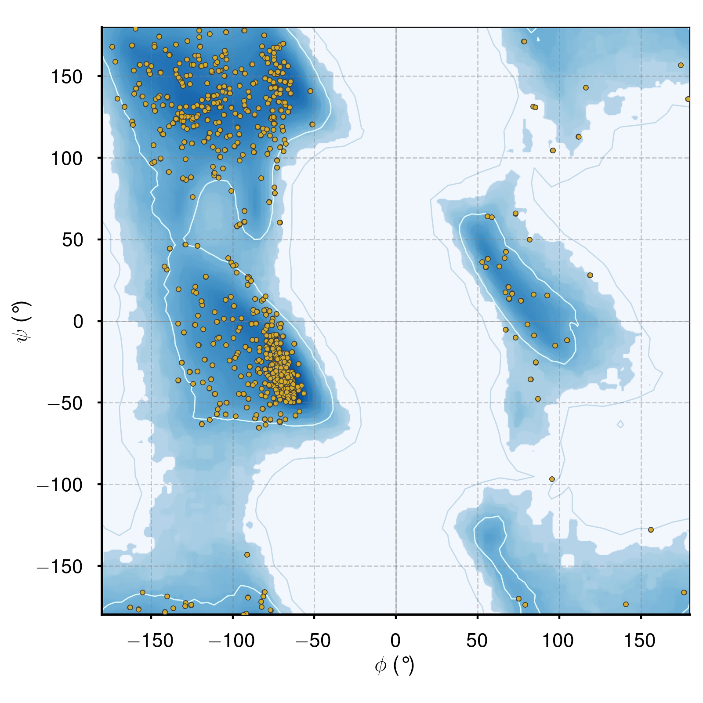
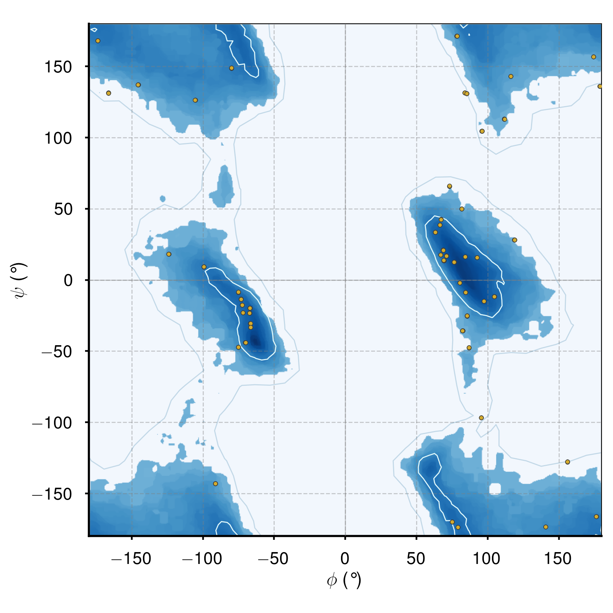
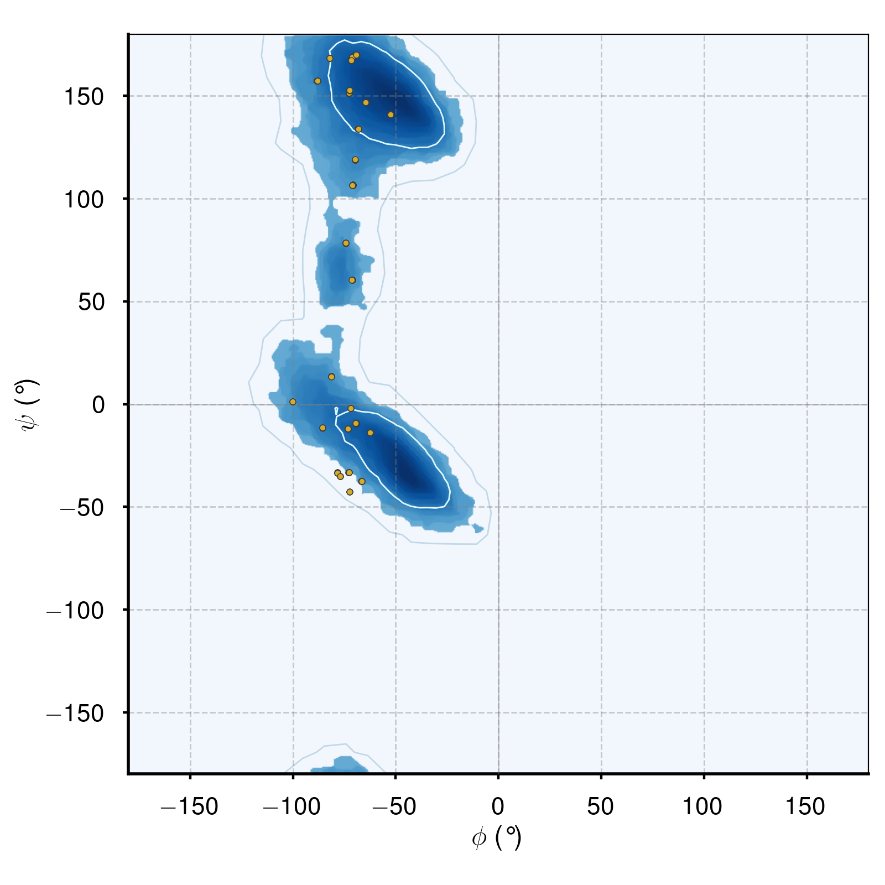

# Ramachandran Plotter


## Requirements:

Python 3.8

Modules:
- Numpy
- Pandas
- Matplotlib
- Scipy
- cv2
- sys
- subprocess

Phenix Suite (install [here](https://www.phenix-online.org/download/))


## Example Ouput Figures

#### All angle plot 


#### Glycine only plot


#### Proline only plot



## Run Instructions

	python3 DihedralCalculator.py [file-name]
	python3 RamachandranPlot.py [file-name] [plot-code]

where [file-name] is your PDB file name (include path if necessary). [plot-code] can be any of the following integers to determine the type of output plot desired:

- 0 = All angles 
- 1 = General angles	(All angles excluding Gly, Pro, Ile and Val)
- 2 = Glycine angles only
- 3 = Trans-proline angles only 
- 4 = Cis-proline angles only 
- 5 = Proline (cis/trans) angles only 
- 6 = Pre-proline angles only (angles preceding a Pro residue)
- 7 = Ile-Val angles only 

The first command generates a CSV of your input peptides dihedral angles using the phenix.ramalyze function included in the Phenix Suite of 
structural tools. 

The second command takes the CSV (where multiple peptides have had their dihedral angles calculated, the peptide PDB file name must also be given)
and creates a Ramachandran plot. The type of plot returned is determined by the plot code. 

Backgrounds to Ramachandran plots are generated using the results of phenix.ramalyze applied to all peptides from the Top8000 peptide database. 
These are peptides for which models have been solved at very high resolutions and dihedral angles are assumed to be at their true values. 

Several parameters can be easily adjusted to change the appearence of the returned graph. 


To run both the DihedralCalculator and RamachandranPlotter in a single command:

	python3 DihedralCalculator.py [file-name] && python3 RamachandranPlot.py [file-name] [plot-code]

To generate several Ramachandran plots using a single command, use ```&&``` like so:

	python3 RamachandranPlot.py [file-name] [plot-code] && python3 RamachandranPlot.py [file-name] [plot-code] && python3 RamachandranPlot.py ...

## Adjustable Variables (recommended)

| Parameter | Variable name | Description |
| :--- | :--- | :--- | 
|Figure size| figure_size |Adjusts the output figure size (inches) as a tuple|
|Figure resolution | out_resolution|Output final figure resolution (high values will slow the process down)|
|Inner contour line level |contour_level_inner|Level at which to draw the inner contour lines. Should be a value between 0-100 to represent to percemtile at which dihedral angles from the Top8000 peptide DB fall within. e.g. a value 96 coresponds to the area where at least 96 % of dihedral angles fall within. |
| Outer contour line level | contour_level_outer |Level at which to draw the outer contour lines. Should be a value between 0-100 to represent to percemtile at which dihedral angles from the Top8000 peptide DB fall within. e.g. a value 15 coresponds to the area where at least 15 % of dihedral angles fall within. |
|Favoured region colour |background_colour| Colour of the favoured dihedral angle region data points are plotted against*. |
|Inner contour line colour |contour_line_color_inner|Colour of inner contour lines. |
|Outer contour line colour |contour_line_color_outer|Colour of outer contour lines. |
|Data point colour |data_point_colour |Colour of data point for all dihedral angle pairs. |
|Outlier colour |outlier_colour|Colour of dihedral angle outliers. |
|Data point edge colour |data_point_edge_colour |Colour of the borders for data point colours (outlier and favoured).|

\* options for sequential colour maps (recommended):
['Greys', 'Purples', 'Blues', 'Greens', 'Oranges', 'Reds',
'YlOrBr', 'YlOrRd', 'OrRd', 'PuRd', 'RdPu', 'BuPu',
'GnBu', 'PuBu', 'YlGnBu', 'PuBuGn', 'BuGn', 'YlGn']


### Author Details

Joseph I. J. Ellaway

josephellaway@gmail.com

MSc Bioinformatics and Theoretical Systems Biology, Imperial College London
BSc Biochemistry with a Year in Research, Imperial College London


## Acknowledgments
Code to make these plots was written for my final year project report, supervised by Dr James W. Murray. 

Example plots were generated using the GAPDH-CP12-PRK cryoEM structure from [McFarlane et. al. (2019)](https://www.pnas.org/content/116/42/20984) [(PDB: 6GVE)](https://www.rcsb.org/structure/6GVE).
